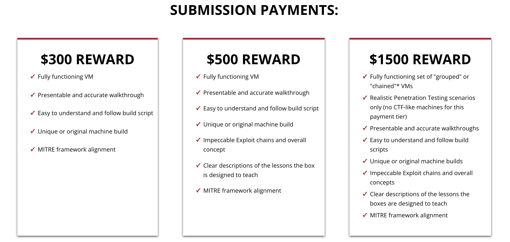
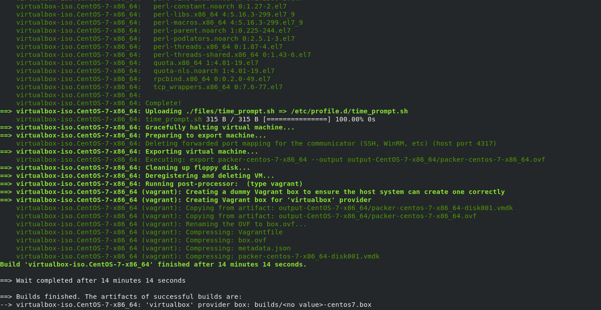

# Art of Creating Machines

- [1) Getting Started](#1-getting-started)
  * [1.1) Introduction to UGC Program](#11-introduction-to-ugc-program)
  * [1.2) Researching](#12-researching)
  * [1.3) Setting up Environment](#13-setting-up-environment)
    + [1.3.1) Linux Environment](#131-linux-environment)
    + [1.3.2) Windows Environment](#132-windows-environment)
- [2) Building Machines](#2-building-machines)
  * [2.1) Active Directory](#21-active-directory)
    + [2.1.1) Setting up an Active Directory Domain](#211-setting-up-an-active-directory-domain)
    + [2.1.2) Joining a machine to Active Directory Domain](#212-joining-a-machine-to-active-directory-domain)
    + [2.1.3) Setting up Child Domain](#213-setting-up-child-domain)
    + [2.1.4) Configuring Services](#214-configuring-services)
    + [2.1.5) Configuring AD Accounts](#215-configuring-ad-accounts)
  * [2.2) Windows](#22-windows)
    + [2.2.1) Setting up an Windows Machine](#221-setting-up-an-windows-machine)
    + [2.2.2) Configuring Windows Accounts](#222-configuring-windows-accounts)
    + [2.2.3) Creating Services using nssm](#223-creating-services-using-nssm)
    + [2.2.4) Deploying Apache Server](#224-deploying-apache-server)
    + [2.2.5) Installing applications](#225-installing-applications)
    + [2.2.6) Deploying MSSQL Server](#226-deploying-mssql-server)
  * [2.3) Linux](#23-linux)
    + [2.3.1) Setting up an Linux Machine](#231-setting-up-an-linux-machine)
    + [2.3.2) Configuring Linux Accounts](#232-configuring-linux-accounts)
    + [2.3.3) Creating Services using systemd](#233-creating-services-using-systemd)
    + [2.3.4) Deploying Apache Server](#234-deploying-apache-server)
    + [2.3.5) Installing applications](#235-installing-applications)
    + [2.3.6) Deploying MySQL Server](#236-deploying-mysql-server)
  * [2.3) Wrapping Up](#23-wrapping-up)
- [3) Packer(#3-packer)
  * [3.1) Building vagrant images
- [4) The End](#4-the-end)

---

# 1) Getting Started

## 1.1) Introduction to UGC Program

User-Generated Content Program is a program that allows people to make submission to Offensive Security Proving Grounds lab and receive compensation upon acceptance after being reviewed by the Labs Team.

As of 11th January 2022, the rewards are as following:



You can find more information here :

- [https://www.offensive-security.com/labs/submit/](https://www.offensive-security.com/labs/submit/)
- [https://help.offensive-security.com/hc/en-us/articles/360049610511-User-Generated-Content-FAQ](https://help.offensive-security.com/hc/en-us/articles/360049610511-User-Generated-Content-FAQ)

## 1.2) Researching

So before starting to build a machine, you’ll have to first perform a lot of researching to develop an idea for the machine. Following are some examples of what I personally do :

- Great place to start would be on twitter and look for any interesting research by companies / individuals. You should also bookmark them so you can check regularly if they added anything new.
- Stay updated on new vulnerabilities through twitter or [The Daily Swig](https://portswigger.net/daily-swig/vulnerabilities) by PortSwigger.
- If you’re planning to build a CVE based machine, browsing through [exploit-db.com](http://exploit-db.com) and [cve.mitre.org](http://cve.mitre.org) will be very helpful.
- Keep an eye on [Exploit Database Security Papers](https://www.exploit-db.com/papers) for new papers.

In the end it all comes down to how creative you can be with vulnerabilities you have discovered and if they go well with each other to make a complete machine. You can reach out to the Labs Team on [Offensive Security Discord](https://discord.com/invite/offsec) in #user-generated-content channel to get your ideas reviewed by them before proceeding to make the machine.

## 1.3) Setting up Environment

You can use Vagrant to easily deploy and destroy VM’s on VMware / VirtualBox. Following links will be helpful for the installation and configuring the providers :

- [https://www.vagrantup.com/docs/installation](https://www.vagrantup.com/docs/installation) [ Vagrant Installation ]
- [https://www.vagrantup.com/docs/providers/virtualbox](https://www.vagrantup.com/docs/providers/virtualbox) [ VirtualBox Provider ]
- [https://www.vagrantup.com/docs/providers/vmware/installation](https://www.vagrantup.com/docs/providers/vmware/installation) [ Installing VMware provider ]
- [https://vagrantcloud.com/search](https://vagrantcloud.com/search) [ VM Images ] **

### 1.3.1) Linux Environment

Following is an example on how to deploy a Ubuntu 20.04 VM using vagrant on VMware provider :

i) Create a directory with the following structure :


- **box** directory here will be used for the Vagrant environment.
- **data** directory will be mounted on the machine so we can share files easily.

ii) Move into box directory and run the following command to initialize the directory to be a Vagrant environment by creating an initial Vagrantfile :

- **vagrant init bento/ubuntu-20.04**

iii) Next step is to edit VagrantFile :

- Editing VM provider to vmware_desktop and mounting data directory on the machine :


iv) For deploying the VM, run the following command from the box directory :

- **vagrant up**

v) To interact with the box, you can ssh by running the following command from the box directory :

- **vagrant ssh**


vi) To stop the VM, run the following command :

- **vagrant halt**

vii) To destroy the VM, run the following command : [ NOTE: Everything will be lost except files in data directory ]

- **vagrant destroy**

### 1.3.2) Windows Environment

Following is an example on how to deploy a Windows Server 2019 Standard Desktop VM using vagrant on VMware provider :

i) Create a directory with the following structure :


- **box** directory here will be used for the Vagrant environment.
- **data** directory will be mounted on the machine so we can share files easily.

ii) Move into box directory and run the following command to initialize the directory to be a Vagrant environment by creating an initial Vagrantfile :

- **vagrant init gusztavvargadr/windows-server-2019-standard-desktop**

iii) Next step is to edit VagrantFile :

- Editing VM provider to vmware_desktop and mounting data directory on the machine :


iv) For deploying the VM, run the following command from the box directory :

- **vagrant up**

v) To interact with the box, you can ssh by running the following command from the box directory :

- **vagrant ssh**


vi) To stop the VM, run the following command :

- **vagrant halt**

vii) To destroy the VM, run the following command : [ NOTE: Everything will be lost except files in data directory ]

- **vagrant destroy**

# 2) Building Machines

In this section you will find some examples on how to setup / configure certain things for Active Directory and Windows using PowerShell. It will help you get the idea on how things are done.

## 2.1) Active Directory

### 2.1.1) Setting up an Active Directory Domain

i) After deploying a Windows Server 2019 VM, we’ll change the administrator password and rename the machine using the following powershell commands :

```powershell
# Changing Admin Password
net user administrator 'P@$$w0rd!1234' /active:yes

# Changing Machine name
$SecPassword = ConvertTo-SecureString 'P@$$w0rd!1234' -AsPlainText -Force
$Cred = New-Object System.Management.Automation.PSCredential('Administrator', $SecPassword)

Rename-Computer -NewName "DC01" -DomainCredential $Cred -Restart
```

- Machine will reboot in the end.

ii) Next we’ll be configuring DNS , installing active directory domain services and promote the server to a domain controller using the following powershell commands :

```powershell
# Setting DNS Server Addresses
Set-DnsClientServerAddress -InterfaceIndex (Get-NetAdapter).InterfaceIndex -ServerAddresses ("127.0.0.1","8.8.8.8")

# Installing AD Domain Services
Install-WindowsFeature -Name AD-Domain-Services -IncludeManagementTools

# Promoting to a domain controller
$SecPassword = ConvertTo-SecureString 'P@$$w0rd!1234' -AsPlainText -Force
Install-ADDSForest -DomainName "based.offsec" -CreateDnsDelegation:$false -DatabasePath "C:\Windows\NTDS" -SafeModeAdministratorPassword $SecPassword -DomainMode "7" -DomainNetbiosName "BASED" -ForestMode "7" -InstallDns:$true -LogPath "C:\Windows\NTDS" -SysvolPath "C:\Windows\SYSVOL" -Force:$true
```

- For better understanding of Install-ADDSForest arguments please refer : [https://docs.microsoft.com/en-us/powershell/module/addsdeployment/install-addsforest](https://docs.microsoft.com/en-us/powershell/module/addsdeployment/install-addsforest)
- Machine will reboot in the end.

### 2.1.2) Joining a machine to Active Directory Domain

i) After deploying a windows vm of your choice , we’ll change the local administrator password and rename the machine using the following powershell commands :

```powershell
# Changing Admin Password
net user administrator 'ClientMachine123!!' /active:yes

# Changing Machine name
$SecPassword = ConvertTo-SecureString 'ClientMachine123!!' -AsPlainText -Force
$Cred = New-Object System.Management.Automation.PSCredential('Administrator', $SecPassword)

Rename-Computer -NewName "CLIENT01" -DomainCredential $Cred -Restart
```

- Machine will reboot in the end.

ii) Next we’ll be configuring the DNS and connecting to the AD Domain :

```powershell
# Setting DNS
Write-Host "[2] Setting DNS and Connecting to Domain"
$DC01= Read-Host "Enter DC01 IP Address"
Set-DnsClientServerAddress -InterfaceIndex (Get-NetAdapter).InterfaceIndex -ServerAddresses ("$DC01","8.8.8.8")

# Adding CLIENT01 to based.offsec domain
$SecPassword = ConvertTo-SecureString 'P@$$w0rd!1234' -AsPlainText -Force
$Cred = New-Object System.Management.Automation.PSCredential('BASED\Administrator', $SecPassword)
Add-Computer -DomainName based.offsec -Credential $Cred -Restart -Force
```

- DC01 should be running.
- Machine will reboot in the end.

### 2.1.3) Setting up Child Domain

i) After deploying a Windows Server 2019 VM, we’ll change the administrator password and rename the machine using the following powershell commands :

```powershell
# Changing Admin Password
net user administrator 'VeryBasedIndeed123!'

# Changing Machine name
$SecPassword = ConvertTo-SecureString 'VeryBasedIndeed123!' -AsPlainText -Force
$Cred = New-Object System.Management.Automation.PSCredential('Administrator', $SecPassword)

Rename-Computer -NewName "DC02" -DomainCredential $Cred -Restart
```

- Machine will reboot in the end.

ii) Next we’ll be configuring DNS , Installing Active Directory domain services and promoting to a domain controller in a child domain ( child.based.offsec ) :

```powershell
# Setting DNS Ip Address as DC01
$DC01= Read-Host "Enter DC01 IP Address"
Set-DnsClientServerAddress -InterfaceIndex (Get-NetAdapter).InterfaceIndex -ServerAddresses ("$DC01","8.8.8.8")

# Installing AD Domain Services
Install-WindowsFeature -Name AD-Domain-Services -IncludeManagementTools

# Promoting to a domain controller
$SecPassword = ConvertTo-SecureString 'P@$$w0rd!1234' -AsPlainText -Force
$Cred = New-Object System.Management.Automation.PSCredential('BASED\Administrator', $SecPassword)
Install-ADDSDomain -Credential $Cred -NewDomainName "child" -ParentDomainName "based.offsec" -InstallDNS -CreateDNSDelegation -NewDomainNetbiosName "CHILD" -DomainMode "7" -ReplicationSourceDC "DC01.based.offsec" -SafeModeAdministratorPassword $SecPassword -DatabasePath "C:\Windows\NTDS" -LogPath "C:\Windows\NTDS" -SysvolPath "C:\Windows\SYSVOL" -Force:$true
```

- For better understanding of Install-ADDSDomain arguments, please refer : [https://docs.microsoft.com/en-us/powershell/module/addsdeployment/install-addsdomain](https://docs.microsoft.com/en-us/powershell/module/addsdeployment/install-addsdomain?view=windowsserver2022-ps)
- DC01 should be running.
- Machine will reboot in the end.

### 2.1.4) Configuring Services

i) Configuring WinRM using PowerShell :

```powershell
Set-Service WinRM -StartMode Automatic
 
# Verify start mode and state - it should be running
Get-WmiObject -Class win32_service | Where-Object {$_.name -like "WinRM"}

Set-Item WSMan:localhost\client\trustedhosts -Value * -Force

# Opening WinRM port in firewall
netsh advfirewall firewall add rule name="WinRM-HTTP" dir=in localport=5985 protocol=TCP action=allow
```

ii) Configuring RDP using PowerShell :

```powershell
Set-ItemProperty 'HKLM:\SYSTEM\CurrentControlSet\Control\Terminal Server\' -Name "fDenyTSConnections" -Value 0
Set-ItemProperty 'HKLM:\SYSTEM\CurrentControlSet\Control\Terminal Server\WinStations\RDP-Tcp\' -Name "UserAuthentication" -Value 0

Enable-NetFirewallRule -DisplayGroup "Remote Desktop"
```

iii) Installing ADCS using PowerShell :

```powershell
Add-WindowsFeature Adcs-Cert-Authority -IncludeManagementTools
Install-AdcsCertificationAuthority -CAType EnterpriseRootCA -Force:$true
```

### 2.1.5) Configuring AD Accounts

i) Disabling password complexity :

```powershell
secedit /export /cfg c:\secpol.cfg
(gc C:\secpol.cfg).replace("PasswordComplexity = 1", "PasswordComplexity = 0") | Out-File C:\secpol.cfg
secedit /configure /db c:\windows\security\local.sdb /cfg c:\secpol.cfg /areas SECURITYPOLICY
rm -force c:\secpol.cfg -confirm:$false
gpupdate /force
```

ii) Adding user to an AD domain :

```powershell
$UserPassword = ConvertTo-SecureString 'password123' -AsPlainText -Force
New-ADUser -Name "Enox" -GivenName "Enox" -SamAccountName "enox" -AccountPassword $UserPassword -ChangePasswordAtLogon $False -Enabled $True 
```

iii) Active Directory Groups :

⇒ Remote Management Users - users part of this group are able to WinRM to the machine.

```powershell
net localgroup "Remote Management Users" /add enox /dom
```

⇒ Remote Desktop Users - users part of this group are able to RDP to the machine. [ NOTE: You’ll also have to grant the user SeRemoteInteractiveLogonRight ]

```powershell
# Adding user to Remote Desktop Users group
net localgroup "Remote Desktop Users" /add enox /dom

# Granting SeRemoteInteractiveLogonRight using Carbon
$Identity = "BASED\enox"
$CarbonDllPath = "C:\Data\Carbon\bin\Carbon.dll"
[Reflection.Assembly]::LoadFile($CarbonDllPath)
[Carbon.Lsa]::GrantPrivileges( $Identity , "SeRemoteInteractiveLogonRight" )
```

- Carbon Download Link : [http://get-carbon.org/about_Carbon_Installation.html](http://get-carbon.org/about_Carbon_Installation.html)

iv) Configuring ACLs :

- Granting GenericWrite on a user [ siddicky → GenericWrite → enox ] :

```powershell
$ADSI = [ADSI]"LDAP://CN=Enox,CN=Users,DC=based,DC=offsec"
$IdentityReference = (New-Object System.Security.Principal.NTAccount("siddicky")).Translate([System.Security.Principal.SecurityIdentifier])
$ACE = New-Object System.DirectoryServices.ActiveDirectoryAccessRule $IdentityReference,"GenericWrite","Allow"
$ADSI.psbase.ObjectSecurity.SetAccessRule($ACE)
$ADSI.psbase.commitchanges()
```

- Granting GenericWrite on Domain Controller [ enox → GenericWrite → DC01 ] :

```powershell
$ADSI = [ADSI]"LDAP://CN=DC01,OU=Domain Controllers,DC=based,DC=offsec"
$IdentityReference = (New-Object System.Security.Principal.NTAccount("enox")).Translate([System.Security.Principal.SecurityIdentifier])
$ACE = New-Object System.DirectoryServices.ActiveDirectoryAccessRule $IdentityReference,"GenericWrite","Allow"
$ADSI.psbase.ObjectSecurity.SetAccessRule($ACE)
$ADSI.psbase.commitchanges()
```

v) Granting a domain user privilege to logon locally on DC :

```powershell
$Identity = "BASED\siddicky"
$CarbonDllPath = "C:\Data\Carbon\bin\Carbon.dll"
[Reflection.Assembly]::LoadFile($CarbonDllPath)
[Carbon.Lsa]::GrantPrivileges( $Identity , "SeInteractiveLogonRight" )
```

## 2.2) Windows

- Please check pinned messages in #user-generated-content channel on Offensive Security discord to get the sample build script for windows.

### 2.2.1) Setting up an Windows Machine

After deploying a Windows VM, we’ll change the administrator password and rename the machine using the following powershell commands :

```powershell
# Changing Admin Password
net user administrator 'MakingMachines2022!!' /active:yes

# Changing Machine name to BASED
$SecPassword = ConvertTo-SecureString 'MakingMachines2022!!' -AsPlainText -Force
$Cred = New-Object System.Management.Automation.PSCredential('Administrator', $SecPassword)

Rename-Computer -NewName "BASED" -DomainCredential $Cred -Restart
```

- Machine will reboot in the end.

### 2.2.2) Configuring Windows Accounts

i) Creating user :

```powershell
# Creating user
net user coaran "VeryBasedMoment!!" /add

## Configuring User Profile
$password = ConvertTo-SecureString 'VeryBasedMoment!!' -AsPlainText -Force
$Cred = New-Object System.Management.Automation.PSCredential('BASED\coaran', $password)
Start-Process PowerShell -Cred $Cred -ArgumentList 'whoami'
```

ii) Granting Privileges using [Carbon](http://get-carbon.org/) :

- You can find list of privileges that can be granted using Carbon [here](http://get-carbon.org/Grant-Privilege.html)
- Example granting SeBackupPrivilege :

```powershell
# Giving Privileges
$Identity = "coaran"
$CarbonDllPath = "C:\Data\Carbon\bin\Carbon.dll"
[Reflection.Assembly]::LoadFile($CarbonDllPath)
[Carbon.Lsa]::GrantPrivileges( $Identity , "SeBackupPrivilege" )
```

### 2.2.3) Creating Services using nssm

If you have ever wanted to create a service that for example runs a flask application or a powershell script you can use [nssm](https://nssm.cc/download) to set it up. 

- Installing nssm on the machine using powershell :

```powershell
# Downloading nssm
Invoke-WebRequest -uri 'https://nssm.cc/release/nssm-2.24.zip' -outfile C:\Windows\Temp\nssm.zip

# Unzipping the files to C:\Program Files
Expand-Archive -LiteralPath C:\Windows\Temp\nssm.zip -DestinationPath "C:\Program Files"

# Granting read and execute perms for everyone
cmd /c 'icacls "C:\Program Files\nssm-2.24" /grant Everyone:rx /T'
```

⇒ Example 1 : [ Running a flask application as a service ]

```powershell
# Creating service
& "C:\Program Files\nssm-2.24\win64\nssm.exe" install FlaskService "C:\Program Files\Python39\python.exe" "C:\Projects\test\app.py"

# User to run the service as
& "C:\Program Files\nssm-2.24\win64\nssm.exe" set FlaskService ObjectName 'BASED\coaran' 'VeryBasedMoment!!'

# AUTO_START on system boot
& "C:\Program Files\nssm-2.24\win64\nssm.exe" set FlaskService Start SERVICE_AUTO_START

# If it fails to start then it will attempt to start again after 20 seconds
cmd /c 'sc failure FlaskService reset= 0 actions= restart/20/restart/20/restart/20'

# Configuring Privileges to avoid SeImpersonatePrivilege
cmd /c 'sc privs FlaskService SeChangeNotifyPrivilege/SeCreateGlobalPrivilege/SeIncreaseWorkingSetPrivilege'

# Starting the service
& "C:\Program Files\nssm-2.24\win64\nssm.exe" start FlaskService
```

⇒ Example 2 : [ Running powershell script as a service ]

```powershell
# Creating Service
& "C:\Program Files\nssm-2.24\win64\nssm.exe" install PSService "C:\Windows\System32\WindowsPowerShell\v1.0\powershell.exe" "
-ExecutionPolicy Bypass -NoProfile -File C:\Projects\script.ps1"

# User to run the service as
& "C:\Program Files\nssm-2.24\win64\nssm.exe" set PSService ObjectName 'BASED\coaran' 'VeryBasedMoment!!'

# AUTO_START on system boot
& "C:\Program Files\nssm-2.24\win64\nssm.exe" set PSService Start SERVICE_AUTO_START

# If it fails to start then it will attempt to start again after 20 seconds
cmd /c 'sc failure PSService reset= 0 actions= restart/20/restart/20/restart/20'

# Configuring Privileges to avoid SeImpersonatePrivilege
cmd /c 'sc privs PSService SeChangeNotifyPrivilege/SeCreateGlobalPrivilege/SeIncreaseWorkingSetPrivilege'

# Starting the service
& "C:\Program Files\nssm-2.24\win64\nssm.exe" start PSService
```

### 2.2.4) Deploying Apache Server

i) Deploying Apache using xampp :

- Download XAMPP from : [https://sourceforge.net/projects/xampp/files/](https://sourceforge.net/projects/xampp/files/)
- We’ll be using xampp portable, following is how you can deploy it in powershell :

```powershell
# Downloading and Extracting XAMPP
iwr -uri 'https://webwerks.dl.sourceforge.net/project/xampp/XAMPP%20Windows/8.1.1/xampp-portable-windows-x64-8.1.1-2-VS16.zip' -outfile C:\Windows\Temp\xampp.zip -TimeoutSec 9999999
Expand-Archive -LiteralPath C:\Windows\Temp\xampp.zip -DestinationPath "C:\"

# Creating Apache Service
## Adding user
net user apache "Password!!" /add

## Granting "Logon as a service" & "Act as part of the Operating System" privilege
$Identity = "apache"
$CarbonDllPath = "C:\Data\Carbon\bin\Carbon.dll"
[Reflection.Assembly]::LoadFile($CarbonDllPath)
[Carbon.Lsa]::GrantPrivileges( $Identity , "SeServiceLogonRight" )
[Carbon.Lsa]::GrantPrivileges( $Identity , "SeTcbPrivilege" )

## Granting Perms
cmd /c 'icacls "C:\xampp" /grant apache:(OI)(CI)F /T'

## Installing Service
C:\Xampp\apache\bin\httpd.exe -k install -n "Apache HTTP Server"
cmd /c sc.exe config "ApacheHTTPServer" obj= ".\apache" password= "Password!!"

## Configuring privileges to avoid SeImpersonatePrivilege
cmd /c sc.exe privs ApacheHTTPServer SeChangeNotifyPrivilege/SeCreateGlobalPrivilege/SeIncreaseWorkingSetPrivilege

cmd /c 'sc failure ApacheHTTPServer reset= 0 actions= restart/20/restart/20/restart/20'

## Adding Firewall rule and starting the service
New-NetFirewallRule -DisplayName 'Port 80 for Apache' -Profile 'Any' -Direction Inbound -Action Allow -Protocol TCP -LocalPort 80

cmd /c sc.exe start ApacheHTTPServer
```

- Confirming the service is working fine :


- If the service failed to start you can take a look at the event logs to find out more information :


For more info on Get-EventLog refer : [https://docs.microsoft.com/en-us/powershell/module/microsoft.powershell.management/get-eventlog](https://docs.microsoft.com/en-us/powershell/module/microsoft.powershell.management/get-eventlog?view=powershell-5.1)

### 2.2.5) Installing applications

If you’re trying to install an application on windows using the command line you should search for a guide/documentation to see if you can find anything about it.

- Example : [ Installing Python ]

```powershell
# Downloading the setup
Invoke-WebRequest -uri 'https://www.python.org/ftp/python/3.9.0/python-3.9.0-amd64.exe' -outfile C:\Windows\Temp\python-3.9.0.exe

# Installing
C:\Windows\Temp\python-3.9.0.exe /quiet InstallAllUsers=1 PrependPath=1 Include_test=0
```

Reference : [https://docs.python.org/3/using/windows.html#installing-without-ui](https://docs.python.org/3/using/windows.html#installing-without-ui)

### 2.2.6) Deploying MSSQL Server

MSSQL Server can be easily deployed using the following commands : [ Note: Make sure to run as Administrator ]

```powershell
# Retrieving Setup File
mkdir C:\Downloads
wget https://go.microsoft.com/fwlink/?linkid=866658 -UseBasicParsing -OutFile C:\Downloads\sqlexpress.exe

# Extracting Setup files
cmd /c 'C:\Downloads\sqlexpress.exe /ACTION=Download MEDIAPATH=C:\Downloads /MEDIATYPE=Core /QUIET'
sleep 30
C:\Downloads\SQLEXPR_x64_ENU.exe /q /x:C:\Downloads\SQLEXPR_2019
sleep 30

# Copying installation config
copy C:\Data\ConfigurationFile.ini C:\Downloads\SQLEXPR_2019\ConfigurationFile.ini

# Installing MSSQL using the config.
C:\Downloads\SQLEXPR_2019\SETUP.EXE /ConfigurationFile=C:\Downloads\SQLEXPR_2019\ConfigurationFile.ini /IAcceptSQLServerLicenseTerms /SAPWD='MyP@$$w0rd'
```

- ConfigurationFile.ini : [https://github.com/CsEnox/just-some-stuff/blob/main/ConfigurationFile.ini](https://github.com/CsEnox/just-some-stuff/blob/main/ConfigurationFile.ini)
- You can find more information about the setup.exe arguments here : [https://docs.microsoft.com/en-us/sql/database-engine/install-windows/install-sql-server-from-the-command-prompt](https://docs.microsoft.com/en-us/sql/database-engine/install-windows/install-sql-server-from-the-command-prompt)

Now to make sure that MSSQL server was successfully deployed, we’ll try running some queries using Invoke-SqlCmd which is part of SqlServer module which has to be installed :

```powershell
# Installing the module 
Install-PackageProvider -Name NuGet -MinimumVersion 2.8.5.201 -Force
Install-Module -Name "SqlServer" -Force

# Running Queries 
Invoke-SqlCmd -ServerInstance "(local)" -Query "SELECT GETDATE()"
Invoke-SqlCmd -ServerInstance "(local)" -Query "SELECT SERVERPROPERTY('MachineName')"
Invoke-SqlCmd -ServerInstance "(local)" -Query "SELECT IS_SRVROLEMEMBER('sysadmin')"

```


## 2.3) Linux

### 2.3.1) Setting up an Linux Machine

The simplest method for managing linux systems through the use of script is the `expect` command. This allows an administrator to be able to automate most tasks. We will configure our hostname and set a new password for the root account.
When you are not using the `expect` script their multiple command line tricks that can be used automatically to make this possible.

```commandline
echo -e "${UserPassword}\n${UserPassword}" | passwd root

# We use this command to set the hostname to base
hostnamectl --static set-hostname 'BASE'
```

I have set the system to reboot just to ensure the configuration is applied correctly. It is possible to set the hostname via the Vagrantfile if you're operating in environment in which DHCP can manage that.

### 2.3.2) Configuring Linux Accounts

Provisioning linux account's can be achieved automatically via a bash script similar to the one shown below. The group in which the user is added into is very important as that determines the users permissions.

```commandline
UserPassword="adminpassword"
useradd -m -G root systemadmin
echo -e "${UserPassword}\n${UserPassword}" | passwd systemadmin
```

The sudoers file is special file in linux that allows you to configure permissions and privileges. It is very dynamic and extensible. In order to learn more ensure to type the following command `man sudoers`.

### 2.3.3) Creating Services using systemd

SystemD is the daemon used to manage the deployment of services. It is very structured as opposed to the old init scripts way of doing things.
The following code block is a minor example of how one can write a basic systemd script. In order to get more insights as how to extend such script please review `man systemd`

```commandline
cat <<EOF >/etc/systemd/system/test-daemon.service
[Unit]                                         
Description=example systemd service unit file. 
                                               
[Service]                                      
ExecStart=/usr/bin/touch /tmp/systemd-service-create-file
ExecStop=/usr/bin/rm /tmp/systemd-service-create-file
                                               
[Install]                                      
WantedBy=multi-user.target
EOF

## Change system permissions and reload the systemd configuration file
/usr/bin/chmod 664 /etc/systemd/system/test-daemon.service
systemctl daemon-reload
```

It is possible to try this out using `systemctl start test-daemon` and verify the file is created in the desired location. Then running `systemctl stop test-daemon` to verify that the file is infact removed. SystemD is not limited to only start and stop commands. It is also possible via `WantedBy` to set up environment dependencies such as a network or a third party service.

### 2.3.4) Deploying Apache Server

On linux deploying an apache web server is not a trivial thing to do. It can in most case's be carried out by running a single command. The key thing is to know the package which would be most relevant to what you are trying to achieve. In the case of XAMPP to download and run a script that handles the installation process for you. 

Running the following as root will install and start a Linux, Apache, MySQL (mariadb), PHP server.

```commandline
curl -s -L https://www.apachefriends.org/xampp-files/8.0.15/xampp-linux-x64-8.0.15-0-installer.run | bash
/opt/lampp/lampp start

## Configure accurate firewall configuration
iptables -A INPUT -p tcp -m multiport --dports 80,443 -m conntrack --ctstate NEW,ESTABLISHED -j ACCEPT
iptables -A OUTPUT -p tcp -m multiport --dports 80,443 -m conntrack --ctstate ESTABLISHED -j ACCEPT
```

This simply downloads and runs the script from the xampp site. There is no systemd service file, so you would need to use the init system type file located in the installation directory with the `/opt/lampp/lampp`. This includes the starting and stopping of the process.

### 2.3.5) Installing applications

As mentioned previously applications can be installed simply by using either `yum` or `apt`. Packages are stored on remote repositories we use package managers to access those packages in those repositories. It is most likely that at times you may encounter packages which are named differently on alternative systems. 

On Centos based systems it would be `yum install -y httpd` and on Debian variations it would be `apt install apache2`. It is also possible to compile from source though this is generally not advised method of installing software on linux.

### 2.3.6) Deploying MySQL Server

On most linux systems installing MySQL is no longer possible or advisable. The preferred version by the community is mariadb which functions just the same as any existing linux system. 

```commandline
apt-get install -y mariadb-server
mysql_secure_installation

## Configure accurate firewall configuration
iptables -A INPUT -p tcp --dport 3306 -m conntrack --ctstate NEW,ESTABLISHED -j ACCEPT
iptables -A OUTPUT -p tcp --sport 3306 -m conntrack --ctstate ESTABLISHED -j ACCEPT
```

Once you have run the `mysql_secure_installation` command it is then possible to proceed with provisioning your database as required.

## 2.4) Wrapping Up

So once you’re done building the machine, you’ll have to drop flags on the machine, do some more configuration and also clean any left over logs/scripts. Following is an example of how I do it for Windows & Active Directory machines :

```powershell
Write-Host "[*] Wrapping Up"

Write-Host "[+] Creating Flags"
New-Item "C:\Users\Administrator\Desktop\proof.txt"
Set-Content "C:\Users\Administrator\Desktop\proof.txt" "md5flag here"
New-Item "C:\Users\coaran\Desktop\local.txt"
Set-Content "C:\Users\coaran\Desktop\local.txt" "md5 flag here"

Write-Host "[+] Disabling IPv6"
Disable-NetAdapterBinding -Name "*" -ComponentID ms_tcpip6

Write-Host "[+] Disabling Sleep Mode"
powercfg /Change monitor-timeout-ac 0
powercfg /Change monitor-timeout-dc 0
powercfg /Change standby-timeout-ac 0
powercfg /Change standby-timeout-dc 0
powercfg /Change hibernate-timeout-ac 0
powercfg /Change hibernate-timeout-dc 0

Write-Host "[+] Disabling Windows Update"
sc stop WaasMedicSvc
sc stop wuauserv
sc stop UsoSvc
Set-ItemProperty -Path "HKLM:\SYSTEM\CurrentControlSet\Services\wuauserv" -Name "Start" -Value 4

Write-Host "[+] Cleaning Up"
Remove-Item -path C:\Windows\Temp\* -Recurse -Force
Remove-Item "C:\Users\*\AppData\Roaming\Microsoft\Windows\Recent\*" -Recurse -Force -ErrorAction SilentlyContinue
Remove-Item "C:\Users\*\AppData\Local\Temp\*" -Recurse -Force -ErrorAction SilentlyContinue
Remove-Item "C:\`$Recycle.Bin\*" -Recurse -Force -ErrorAction SilentlyContinue
Remove-Item "C:\Users\*\AppData\Roaming\Microsoft\Windows\PowerShell\PSReadLine\ConsoleHost_history.txt" -Force -ErrorAction SilentlyContinue
```

# 3) Packer

Packer is a build tool use to manage the development of virtual machines and various types of portable media. It is highly customizable via its HCL configuration and extablable through the use of plugins. In this tutorial we will be looking at how to use packer in order to provision base images to use for vagrant when developing machines and also how to create ISO's as alternative submission format. 

Packer confiration is composed of 3 main parts for our example. That is the following:

Builders: Builders are responsible for creating machines and generating images from them for various platforms 
Provisioners: Provisioners use builtin and third-party software to install and configure the machine image after booting. 
Post-Processors: Post-processors run after the image is built by the builder and provisioned by the provisioner(s).

In order to gain a deeper understanding of this we can start by looking at the documention. There information regarding configration parameters and options is avalible.

## 3.1) Building vagrant images

It is not a major requirement but in some instances of things it is much more suitable to work with standardise images that have a base configuration which is much more suited to your flow. This could be to ensure that the image is hardened and updated so that unexpected exploits can not be used against it. It could also reduce development time and bandwidth requirements since when perform a build its nor longer nessory to run an update when destroy or refreshing a machine to test ensure a scripts idempotency.

This configuration can be written in both HCL or json. In this example we are currently use HCL. The following configuration is an example of an builder that can be used in order to create a VM image. Their various types of builders avalible the key one being `virtualbox-iso`. This enables us to create a VM using an ISO to define the OS to made into vagrant images. 

```
source "virtualbox-iso" "CentOS-ISO-image" { # The builder type including the name to reference the resource
  boot_command            = ["<tab> text ks=http://{{ .HTTPIP }}:{{ .HTTPPort }}/ks.cfg<enter><wait>"] # Command to be run a boot for example loading the kickstart configuration
  boot_wait               = "10s" # This is how long to wait prior to using the boot command
  disk_size               = 104800
  guest_os_type           = "RedHat_64" # The flavour of the OS we intend to install
  headless                = true # This ensure that no gui is present and CLI type of configuration
  http_directory          = "http" 
  iso_checksum            = "sha256:bba314624956961a2ea31dd460cd860a77911c1e0a56e4820a12b9c5dad363f5"
  iso_urls                = ["file:///home/m3rl1n/Downloads/CentOS-7-x86_64-Minimal-1708.iso"]
  shutdown_command        = "sudo /sbin/halt -p" # Enable's you to specify a shutdown command if diffirent from the standard command
  shutdown_timeout        = "5m" 
  ssh_password            = "vagrant" # The password to be configured for the user to used for ssh
  ssh_port                = 22
  ssh_timeout             = "90m"
  ssh_username            = "root" # This creates a base user if one does not exist
  vboxmanage              = [["modifyvm", "{{ .Name }}", "--memory", "2048"], ["modifyvm", "{{ .Name }}", "--cpus", "2"]] # This specifies the configuration of the virtual machine to be created
  virtualbox_version_file = ".vbox_version"
  vm_name                 = "packer-centos-7-x86_64"
}
```

This is a basic working configuration though it can be customised heavily to suite the users environment. The key thing to be understood is that this specifies the configuration for the build command.
 
The build section is the section that specifies the key configuration for the system in question. This section within the HCL configuration also contains the provisioner and post-processor. These section allow us to define the output of the system we are creating and also enables us to provision the system in use based on varying configuratio parameters.

```
build {
  sources = ["source.virtualbox-iso.CentOS-7-ISO-image"]

  provisioner "shell" {
    scripts = ["scripts/base.sh"]
  }

  provisioner "file" {
    destination = "/etc/cron.daily/cleanup.sh"
    source      = "./files/cleanup.sh"
  }

  post-processor "vagrant" {
    output = "builds/<no value>-centos7.box"
  }
}
```

As you can we can use either the `shell` or `file` provisioner in order to transport the files and also provision the system. We use set the vagrant post-prossor which defines the out arttificates for the provision system. In this instance we set this to be a vagrant box image including the location to out the image artifact.

It is then possible to run `packer build <with desired config>`


Once we have finished the configuration what is required from this point onwards is to thus import the box for usage vagrant. This is achieved by running the following command: `vagrant box add builds/name-of-box.box`. You can then from this point add the image to vagrant in order to develop the system correctly.



# 4) The End

Thank you for reading through the guide and I hope things that I’ve provided will be helpful.

- If you have any questions you can reach out to me on Offensive Security Discord (Discord Tag : Enox#4458) or Twitter (@csenox1)
